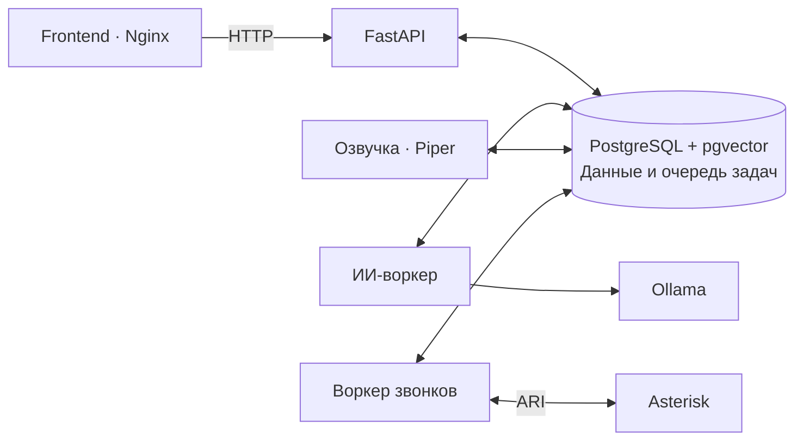

# Тренажёр 112/ДДС · Backend

API учебного тренажёра: пользователи, карточки и сценарии, занятия, оценивание и отчёты. Фоновые воркеры выполняют ИИ-задачи, готовят озвучку и обслуживают учебные звонки.

Python 3.13 · FastAPI · SQLAlchemy · PostgreSQL 17 + pgvector · Docker Compose · uv.

## Развёртывание

Нужны Docker Compose и соседние каталоги `112-backend` / `112-frontend`. Все команды ниже выполняются из `112-backend`.

При первом запуске создайте конфигурацию:

```sh
cp .env.example .env
openssl rand -hex 32
```

Запишите полученное значение в `JWT_SECRET_KEY` в `.env`. Для сервера замените тестовый `POSTGRES_PASSWORD` и обновите пароль в `DATABASE_URL`.

```sh
docker compose up --build -d --wait
docker compose exec llm ollama pull qwen3:4b-instruct-2507-q4_K_M
docker compose exec llm ollama pull qwen3-embedding:0.6b
```

Compose применяет миграции и запускает интерфейс, API, БД, Ollama, ИИ-воркер и озвучку. Модели скачиваются один раз; для первой сборки и загрузки нужен интернет.

- **Интерфейс:** http://localhost:8080
- **Swagger:** http://localhost:8000/docs
- **Первый вход:** `admin` / `admin`; система потребует сменить пароль.

По умолчанию порты доступны только на этом компьютере. Для доступа к серверу настройте HTTPS-прокси на порт `8080`.

### Тестовые данные

На демонстрационном стенде загрузите справочник, пользователей и занятия:

```sh
docker compose exec -T api python scripts/seed_demo.py --database --full-demo --prefix demo --state-file /home/appuser/telephony/.demo-seed.json
```

Логины: `demo-teacher`, `demo-student`; пароли — логин с окончанием `-123`. Повторный запуск восстанавливает эти тестовые пароли. Сохраняйте тот же файл состояния. [Режимы наполнения](docs/SEED.md) · [Состав демонабора и остальные аккаунты](docs/FULL_DEMO.md).

## Разработка

После настройки `.env` установите **uv**. БД работает в Docker, API — локально с автоперезагрузкой. Если API уже запущен в Compose, сначала выполните `docker compose stop api`.

```sh
uv sync --locked
uv run pre-commit install
docker compose up -d --wait db
uv run alembic upgrade head
uv run uvicorn app.main:app --reload --host 0.0.0.0
```

Этот режим запускает только БД и API. Для ИИ, озвучки и звонков нужны соответствующие сервисы Compose. [Проверки и отдельная тестовая БД](docs/DEVELOPMENT.md).

## Сервисы



Piper сохраняет готовые записи в общий том; Asterisk воспроизводит их во время звонка. Телефония включается отдельно профилем `telephony` — [настройка](docs/TELEPHONY.md). [Голоса и озвучка](docs/speech/README.md).

## Структура

```text
app/
  api/       HTTP-обработчики и права доступа
  services/  Учебные процессы и фоновые задачи
  domain/    Общие предметные правила
  schemas/   Контракты и валидация
  models/    Модели БД
  core/, db/ Настройки, инфраструктура, подключение к БД
alembic/     Миграции
scripts/     Наполнение БД и служебные команды
tests/       Тесты
performance/ Нагрузочные проверки
```

Подробнее: [архитектура](docs/BACKEND_ARCHITECTURE.md), [оценивание](docs/ASSESSMENT_ARCHITECTURE.md), [генерация карточек](docs/CARD_GENERATION.md), [память ИИ](docs/ASSESSMENT_MEMORY.md).

[Все инструкции](docs/README.md) · [Как устроено обучение](docs/WORKFLOWS.md)
