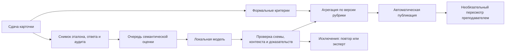

# Автоматическое оценивание и участие ИИ

Последнее решение пользователя: итог обычно появляется автоматически; преподаватель
может пересмотреть его. В этой итерации работает автоматическая формальная оценка,
подключение модели отложено. Ниже реализация отделена от целевой гибридной схемы.

## Реализовано: weighted-fields-v1

После submit сервер атомарно сохраняет карточку, оповещение, событие и Evaluation
методом `rules`. CriterionResult хранит результат каждой группы, CriterionEvidence —
ссылки на сохранение и оповещение. Для каждой оценки сохраняется context_snapshot:
версия правил, эталон, фактическая карточка, адресаты, граница аудита и SHA-256 контекста.
Это воспроизводимый снимок, а не новая оценка при каждом просмотре.

Веса по умолчанию — учебная настройка, не утверждённый профессиональный норматив:

| Группа | Вес |
| --- | ---: |
| Тип происшествия | 25 |
| Оповещённые службы | 25 |
| Компоненты адреса | 30 |
| Имя и телефон заявителя | 10 |
| Количество пострадавших | 10 |

Преподаватель меняет веса в редакторе сценария (1–100). Политика сохраняется в
AnswerKey.rubric версии сценария и копируется в settings_snapshot попытки.
Новая версия не изменяет прежние попытки. Для старых версий без политики используется
явно обозначенная weighted-fields-v1 с весами по умолчанию, зафиксированными при старте.

Внутри группы доля — число совпавших заданных структурированных полей / число таких
полей. Баллы группы = вес × доля. Отсутствующий в эталоне критерий исключается;
нули и false не считаются отсутствием. Оповещение оценивает фактический набор служб,
а не только выбранный список. Набор служб — один критерий, порядок не важен.
Нормализация строк/телефона описана в [AUTOMATIC_CHECK.md](AUTOMATIC_CHECK.md).

Итог ученика за урок = 100 × сумма набранных баллов групп всех карточек /
сумма доступных весов. Округление до двух знаков. Таким образом, учитываются именно
доступные критерии; карточка с более полным эталоном может внести больший вес.
Число мелких компонентов адреса не увеличивает вес всей адресной группы.

Свободный текст, свободный адрес без компонентов и описание пострадавших сейчас
не проверяются по смыслу и не входят в балл. Они явно перечислены как непроверенные.
100 по формальным полям не означает подтверждения профессиональной правильности
всего ответа. Квалификация «допущен к практике» и нормативный проходной балл не вводятся.

Когда сданы все карточки конкретного ученика, автоматически создаётся первая
LessonEvaluation с `method=rules`, шкалой 100, источниками и разрезом по критериям.
Остальных учеников ждать не нужно. Повтор submit не дублирует оценки.
Незавершённый урок не получает нулевую оценку. Если урок начат до обновления,
при последней сдаче недостающие формальные оценки предыдущих карточек достраиваются.

Пересмотр преподавателем — отдельная редакция `method=teacher` с причиной-комментарием
и expected_revision. Автоматический процесс не переписывает её. Для ранее полностью
сданных работ без результата есть идемпотентный teacher POST
`/lessons/{lesson_id}/students/{student_id}/automatic-evaluation`.
Существующий результат, включая ручной, эта команда не изменяет.

## Целевая гибридная схема: следующий этап

ИИ должен принимать решения по заданным смысловым критериям, а не назначать произвольный
общий балл. Финальная арифметика и проверка профессиональных ограничений остаются кодом.

Рекомендуемая рубрика следующей версии:

- Формальные факты и действия: тип, получатели, адрес, существенные числа; правила
  обладают приоритетом там, где есть точный проверяемый факт.
- Смысл: полнота существенных фактов сообщения, отсутствие выдуманных сведений,
  сохранение смысла допустимыми формулировками, обоснованность решения по ситуации.
- Процесс: обязательные этапы и использование подсказок — только если критерий
  предусмотрен заданием. Количество кликов, скорость печати и исправления сами по
  себе не являются ошибками. Временной штраф без явной политики не применяется.

Для каждой версии преподаватель задаёт применимые критерии, веса, допустимые
альтернативы, критические ошибки и условия завершения. Например, доля смысловых
критериев может быть 20–30%, но это предложение для калибровки, а не скрытый вес
текущего алгоритма. Нельзя динамически увеличивать вес правил до 100% и объявлять
гибридный результат полным только из-за недоступности модели.

ИИ выдаёт по критерию `satisfied / partial / failed / abstain`, credit, объяснение,
ссылки на поля и серверные события, версии модели/промпта и hash контекста. Уже
реализованы Pydantic-схема AIAssessmentOutput и validate_ai_decision:
чужой/изменённый контекст, незаданный критерий, ссылка на чужое, позднее или
неподтверждённое браузерное событие отклоняются. Ответ пока нигде не применяется
к результату автоматически: исполнения worker и приёма его решений ещё нет.

При подключении worker нужны следующие правила:

1. Идемпотентное задание AIJob в той же транзакции сдачи; worker использует lease,
   таймаут и ограниченные повторы. Никакого ожидания модели в HTTP submit.
2. Весь ученический текст передаётся как данные, не инструкции. Модель не получает
   права вызывать инструменты, менять маршрутизацию или выполнять команды из ответа.
3. Публикация — если все обязательные критерии обработаны и нет противоречий с
   формальными доказательствами/критическими правилами. Неясность ведёт к повтору,
   затем к выборочной экспертной проверке, а не к оценке каждой работы человеком.
4. Самооценка confidence модели недостаточна. Порог принятия калибруется на наборе
   размеченных преподавателем работ, включая парафразы, пропуски фактов, ошибки адреса,
   неоднозначные ситуации и попытки инструкций внутри ответа. Измеряются расхождения
   с экспертами, доля ручных проверок и ложные пропуски критических ошибок.
5. При недоступности ИИ сохраняется формальный результат с явным статусом неполной
   смысловой проверки; недостающий вес не превращается ни в ноль, ни в бонус.
6. Ручное решение имеет приоритет; поздний ответ worker не меняет его. Повторная
   оценка новой моделью создаёт новую редакцию с происхождением и причиной.

Перед промышленным использованием потребуется согласовать конкретную рубрику и
проверить её на учебных работах. Нет оснований считать текущие тестовые веса
утверждённой методикой или обещать процент автоматического принятия без измерения.

Основа режимов занятий и раздельных результатов: [learning-v1](LEARNING_FOUNDATION.md).
