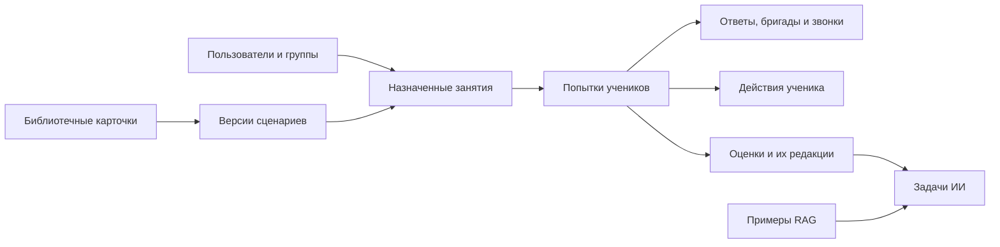

# Как хранятся данные

PostgreSQL хранит учебные данные, очередь фоновых задач и примеры памяти ИИ. Расширение pgvector используется для поиска близких примеров. Отдельная очередь Redis или брокер сообщений для текущего процесса не нужны.

## Основные связи

Это схема связей процесса, а не полный перечень таблиц и внешних ключей.

## Почему используются снимки

Сценарии сохраняют состав карточек, а попытки — настройки обучения и оценивания. Новая редакция справочника, карточки или промпта не должна менять старую работу задним числом.

Формальная оценка, заключение ИИ и пересмотр преподавателя сохраняются отдельно. По результату можно восстановить исходные данные и понять, какая проверка повлияла на балл.

Действия ученика и прокторинг разделены: первые нужны для обучения и оценивания, вторые — для проверки условий прохождения. Наблюдение о потере фокуса не является ошибкой в решении.

## Где смотреть точную схему

- [app/models](../app/models) — текущие ORM-модели.
- [alembic/versions](../alembic/versions) — изменения схемы и преобразования данных.
- [app/schemas](../app/schemas) — публичные контракты и проверка JSON-полей.

[DATABASE_SCHEMA.md](DATABASE_SCHEMA.md) и [DATABASE_TABLES.md](DATABASE_TABLES.md) — ранние проектные снимки. Не используйте их для создания текущей БД. Миграции применяются командой `uv run alembic upgrade head` или при запуске Compose.

[Транзакции и границы модулей](BACKEND_ARCHITECTURE.md) · [Проверки на отдельной БД](DEVELOPMENT.md) · [Оглавление](README.md)
