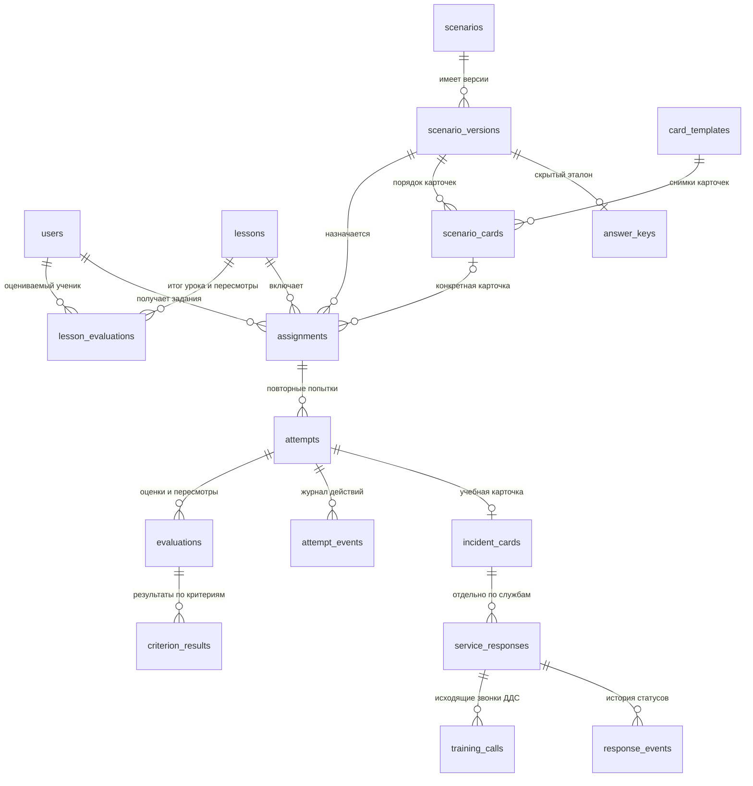
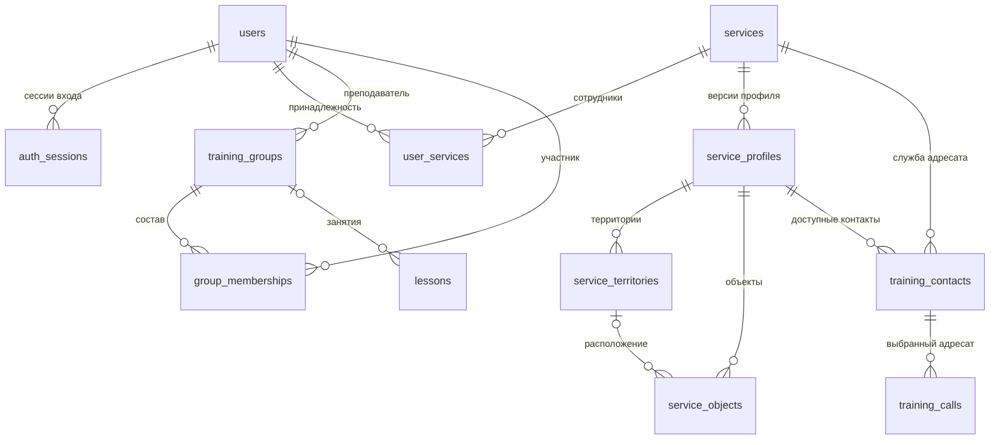
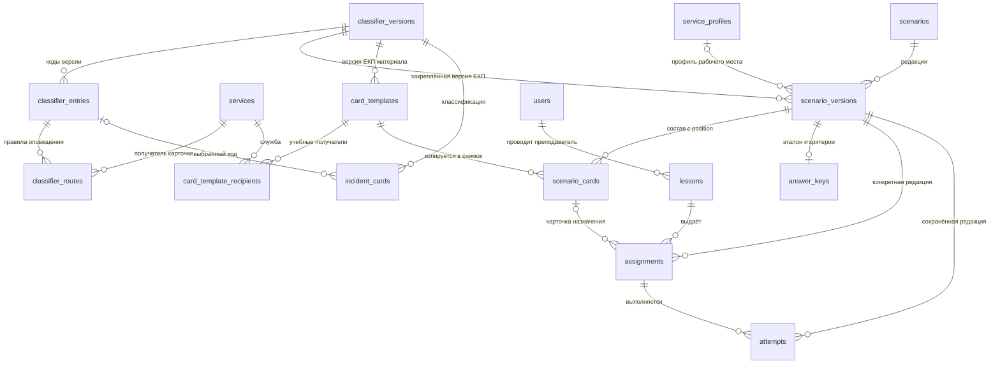
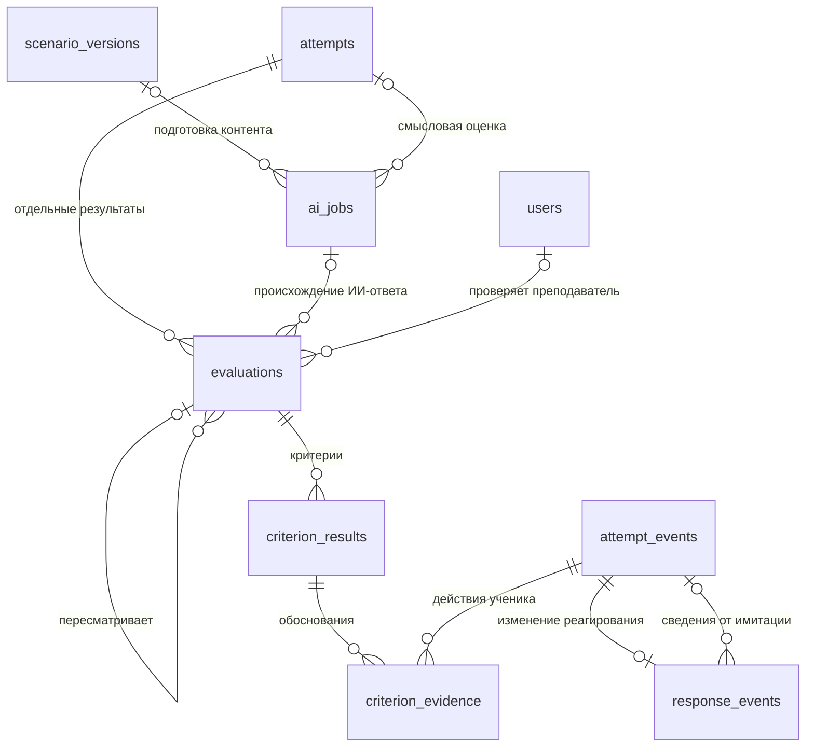

# База данных тренажёра «Система-112»: проект для проверки

Дата: 18.09.2026. **Предложение по структуре данных, а не утверждённая программа обучения.**
Реализованы SQLAlchemy-модели и новая миграция `0002_training_domain` поверх `0001_users`.
Миграция `0003_assignment_position` добавляет положительный `assignments.position`,
уникальный для сочетания урока и ученика. Для существующих назначений порядок
заполняется по `created_at, id`; новая выдача должна следовать `position`.
Миграция `0004_teacher_authoring` добавляет библиотеку карточек, состав сценария и поля
идемпотентного запуска урока. `0005_lesson_evaluations` добавляет историю ручных оценок урока.
`0006_frontend_scenarios` добавляет метаданные сценария; `0007_exclusive_user_role`
запрещает одновременные `is_admin` и `is_teacher`.
Всего 32 таблицы: 2 таблицы авторизации и 30 предметных.
API подготовки групп, карточек, сценариев и запуска урока описан в [TEACHER_API.md](TEACHER_API.md).
Реализованы выполнение оператором 112 и ручная оценка урока: [STUDENT_WORKFLOW.md](STUDENT_WORKFLOW.md).
Импорт исходных XLSX, выполнение ДДС, ИИ и SIP пока не реализованы.

Основания: [локальные уточнения](../../UPDATE.md), [обзор требований](../../REQUIREMENTS_REVIEW.md),
[дополнительные материалы](../../ADDITIONAL_MATERIALS_REVIEW.md),
[проект архитектуры](../../ARCHITECTURE.md). Последнее прямое уточнение о двух учебных ролях
имеет приоритет над прежней трактовкой QA.md.

## 1. Как устроено обучение

Преподаватель собирает версию сценария из карточек и запускает её для своей группы.
Каждому ученику создаются назначения по порядку карточек. Ученик выполняет попытку,
в которой работает с карточкой; действия, реагирование служб и звонки сохраняются отдельно.
По попытке можно получить несколько оценок: проверку правилами, оценку ИИ, пересмотр преподавателя.

В диаграммах `||` — ровно одна запись, `o|` — ноль или одна, `o{` — любое количество.
Диаграммы показывают основные связи; полный перечень колонок и FK — в
[DATABASE_TABLES.md](DATABASE_TABLES.md).

### Предложения, которые нужно проверить

1. **Одна попытка — одна карточка и одна учебная роль.** Несколько последовательных карточек
   на занятии означают несколько назначений с `position` и попыток. Повтор одного задания получает следующий `number`.
   Роль берётся из версии сценария: `operator_112` или `dds`. Один аккаунт получает оба вида заданий.
2. **Назначение индивидуальное.** Занятие может относиться к группе, но список учеников
   фиксируется назначениями. Изменение состава группы не меняет историю уже выданных заданий.
3. **Три режима:** вводное освоение, практика, проверка знаний. Само вводное освоение подтверждено;
   такое разделение режимов — предложение. Порог подсказки и лимит задания задаются отдельно,
   без выдуманных обязательных значений и штрафов.
4. **Профиль ДДС обязателен для сценария ДДС.** Для оператора 112 он необязателен и может давать
   доступный учебный справочник. Привязка аккаунта к службе не назначает учебную роль.
5. **Передача между этапами — копия с происхождением.** `source_card_id` позволяет сохранить
   связь со входной карточкой, не меняя работу её автора. Совместная работа нескольких учеников
   с одной изменяемой карточкой пока не заложена как обязательный процесс.
6. **Конец упражнения задаёт сценарий.** `completion_rules` хранит согласованные условия;
   модель не требует доведения каждой карточки до «Работы завершены».
7. **Эталон версионируется вместе со сценарием.** Если меняются условия, критерии или эталон,
   создаётся новая версия сценария. Независимая библиотека версий эталонов пока не нужна.

## 2. Пользователи, службы и учебные справочники

| Таблица | Назначение |
| --- | --- |
| `users` | Аккаунты с одной ролью; CHECK запрещает совмещение `is_admin` и `is_teacher` |
| `auth_sessions` | Существующие сессии авторизации и хеши refresh-токенов |
| `services` | Устойчивый код и текущее имя службы, признак активности |
| `user_services` | Связь аккаунта с одной или несколькими службами; не прикладное разрешение |
| `service_profiles` | Номер версии, историческое имя, ответственность, правила, утверждение |
| `service_territories` | Учебные территории внутри конкретной версии профиля |
| `service_objects` | Объекты, адреса и ответственность; территория того же профиля, если задана |
| `training_contacts` | Учебные контакты профиля: служба адресата, имя/должность, описание, локальный endpoint |
| `training_groups` | Группы и их преподаватели |
| `group_memberships` | Текущий состав групп |

Территории и объекты здесь — учебный справочник, не геоинформационная система и не карта покрытия
реальных служб. Имя службы и контакта сохраняется также в реагировании/звонке для истории.

`endpoint_key` — логический идентификатор вроде `training-duty`, **не телефонный номер и не SIP URI**.
Будущий SIP-адаптер должен разрешать его только в локальный учебный адрес из белого списка.
Проверка формата ключа в БД сама по себе не обеспечивает изоляцию телефонной сети.

## 3. Версии ЕКП, сценарии и назначения

| Таблица | Что хранится |
| --- | --- |
| `classifier_versions` | Метка версии, файл, ключ хранения, SHA-256, отчёт импорта, утверждение |
| `classifier_entries` | Код, раздел, название, сценарий реагирования из XLSX, условия и исходные ячейки |
| `classifier_routes` | Проверенные соответствия кода службе, условия подключения, признак главной службы |
| `scenarios` | Идентичность учебного сценария и автор |
| `scenario_versions` | Роль, сложность, категория, длительность и учебный ориентир таймера, версии справочников, текст потерпевшего, готовая карточка ДДС, события, подсказки и условия завершения |
| `answer_keys` | Отдельный скрытый эталон: поля, допустимые действия, критерии, объяснения |
| `lessons` | Название занятия, преподаватель, группа при наличии, состояние и время |
| `assignments` | Ученик, занятие, версия сценария, режим, лимит упражнения, задержка подсказок |
| `attempts` | Ученик, версия сценария и номер попытки, снимок настроек, начало/конец и причина окончания |

Уникален **код внутри версии**, а не код среди всех версий классификатора.
`v046_11` и `v046_24` могут храниться одновременно; новая загрузка не заменяет прежнюю автоматически.
`source_data` предназначен для исходных значений по заголовкам, координат, формул и комментариев.
Неоднозначные соответствия остаются в исходных данных и отчёте импорта, а не становятся автоматически
действующими маршрутами. Различие «Сценарий реагирования» и «Главная служба» сохраняется.

Ручной API сохраняет карточку преподавателя в `card_templates`, получателей —
в `card_template_recipients`. Версия сценария фиксирует порядок и снимки в `scenario_cards`.
Для оператора 112 `snapshot.caller_message` — условие, `snapshot.data` — скрытый образец;
для ДДС `snapshot.data` — готовая входная карточка. Новые назначения всегда содержат
`scenario_card_id`, а состав урока определяется назначениями, не текущим составом группы.

Прежние одиночные `scenario_versions.caller_message`, `initial_card` и `answer_keys.expected_card`
сохранены для совместимости исходной схемы. Новый API использует снимки `scenario_cards`;
будущий движок должен читать их через назначение. В старых назначениях `scenario_card_id`
может оставаться `NULL`; миграция не придумывает для них библиотечные карточки.
Ключ `caller_audio_key` предусмотрен для опциональной готовой озвучки; её отсутствие не мешает заданию.

**Ручное создание сценария публикует его состав от имени преподавателя.** API проверяет
владельца, опубликованную версию ЕКП, данные для выбранной роли и профиль ДДС.
Редактирования опубликованного контента через API нет. FK не запрещают прямой SQL UPDATE:
будущие редакторы должны выпускать новые версии. `answer_keys` создаётся пустым;
полнота критериев и эталонов действий ДДС пока не проверяется, автоматическое оценивание не реализовано.

## 4. Карточка, реагирование и события

| Таблица | Что хранится |
| --- | --- |
| `incident_cards` | Источник/происхождение, поля заявителя, адрес, описание, пострадавшие, признаки, код ЕКП, состояние карточки и времена |
| `service_responses` | Отдельная служба на карточке, её статус, время направления/получения/первого решения, номер наряда, комментарий |
| `attempt_events` | Упорядоченный журнал: вид действия, автор, серверное и клиентское время, данные события, идентификатор команды |
| `response_events` | История статусов и комментариев; ссылка на запись журнала и, при наличии, сообщение-основание |
| `training_calls` | Исходящий вызов ДДС: выбранный контакт и служба, состояния соединения, время, результат и ключ записи |

`incident_cards` допускает неполный черновик. `features = NULL` означает, что признаки неизвестны
или не переданы; `false` внутри признака означает известное отрицательное значение.
Адрес хранится как введённый текст и структурированные детали; структура деталей требует контракта
на этапе API. Поля инструкции, не вынесенные в отдельные колонки, сохраняются в `additional_fields`.

| Время | Поля | Учебный смысл |
| --- | --- | --- |
| Создание карточки | `opened_at` → `saved_at` | Открытие формы создания → сохранение; не открытие карточки принимающей ДДС |
| Подтверждение ДДС | `sent_at` → `first_decision_at` | Направление карточки службе → первое «Принята»/«Не принята» |
| Получение в АРМ | `received_at` | Техническое получение, отдельно от решения |
| Выполнение задания | `attempts.started_at` → `ended_at` | Учебная попытка и её собственный лимит |

30 секунд на первичное решение — ориентир памятки от **направления**, не от открытия.
В модель не зашиты ни трёхминутный конец реагирования, ни спорное начало 48-часового отсчёта.

Состояния карточки: `draft`, `registered`, `notified` («Отработана», оповещение завершено),
`completed` («Завершена», завершение работы всех служб). Производные предупреждения о времени
и сводное состояние реагирования предстоит вычислять по утверждённым правилам.

Состояния службы: `added`, `received`, `accepted`, `not_accepted`, `responding`, `arrived`,
`in_progress`, `completed`, `refused`. «Не принята», отказ от работ и завершение работ различаются.
Изменение одной службы не меняет другие службы или карточку автоматически.
Порядок допустимых переходов и исключения конкретных ДДС — задача будущего движка.

Карточка и текущее реагирование имеют `revision`: обычный ORM UPDATE проверяет номер версии
и поднимает `StaleDataError` при устаревшей правке. Массовый SQL UPDATE обходит ORM-проверку;
будущие обработчики должны явно проверять ревизию и атомарно записывать событие.
Уникальность `command_id` не заменяет обработчик повторов: он должен вернуть уже сохранённый результат.

## 5. ИИ, оценка и пересмотр

Ручная итоговая оценка реализована отдельно в `lesson_evaluations`:
урок, ученик, преподаватель, `score`, `max_score`, обязательный комментарий,
ревизия, предшествующая оценка, время и ключ повторного запроса. Преподаватель оценивает
все выполненные назначения ученика вместе; оценки отдельных попыток в `evaluations`
автоматически не создаются. API сохраняет исправления новыми строками и не допускает
оценивания до завершения всех карточек этого ученика.

| Таблица | Что хранится |
| --- | --- |
| `ai_jobs` | Генерация/оценивание, очередь, повторы, аренда обработчика, версии модели и промпта, вход/контекст/ответ, ошибка |
| `evaluations` | Попытка, номер оценки, метод (`rules`, `ai`, `teacher`), готовность, баллы, объяснение и предшествующая оценка |
| `criterion_results` | Код и снимок критерия, баллы, максимальный балл, объяснение |
| `criterion_evidence` | Связь критерия с конкретными событиями той же попытки |

`NULL` в баллах означает отсутствие готового результата, а не ноль.
Максимум хранится явно; обязательная стобалльная шкала, веса и формула итоговой оценки не введены.
Отдельный пересмотр преподавателя хранит причину и ссылку на прежнюю оценку, не заменяя её.
Объединение формальных и смысловых критериев и выбор результата среди оценок отдельных
попыток ещё не реализованы. У ручной оценки урока актуальной является последняя ревизия
`lesson_evaluations`; API сохраняет предыдущие записи.

`ai_jobs` задаёт структуру хранения очереди, но не реализует обработчик: захват задания,
продление аренды, повтор после сбоя и проверка схемы ИИ-ответа остаются отдельной работой.
Изменение эталонов по замечанию преподавателя должно выпускать новую версию сценария;
автоматическое обучение модели на каждой коррекции не предполагается.

## 6. Гарантии и границы реализации

**База данных уже проверяет:**

- FK, уникальность версий и кодов, одну службу на карточке, одну карточку на попытку;
- согласованность ученика/версии сценария попытки с назначением; замена этих полей назначения
  после появления попытки запрещена FK;
- принадлежность кода ЕКП версии карточки, объекта территории того же профиля;
- принадлежность реагирования, его событий, звонков и доказательств оценки одной попытке;
- соответствие выбранного контакта службе-адресату звонка;
- причину непринятия/отказа, диапазоны баллов, положительные номера и интервалы времени;
- наличие профиля у сценария ДДС, сведений об утверждении опубликованной версии,
  автора/причины пересмотра преподавателем;
- сохранность ссылочной истории: предметные FK преимущественно `RESTRICT`.
  Аккаунты с историей следует деактивировать, а не удалять. `CASCADE` оставлен для сессий входа
  и текущего членства в группах/службах.

**API подготовки и запуска уже проверяет:**

- взаимоисключающие роли ученика/преподавателя/администратора и смену стартового пароля;
- владельца группы, карточки, сценария, урока; активность учеников и отсутствие прав персонала;
- опубликованную версию ЕКП, принадлежность кода, допустимость получателей по маршрутам;
- общую версию ЕКП карточек сценария, наличие сообщения для 112 и подходящего профиля для ДДС;
- атомарность запуска, повтор `request_id`, порядок и фиксацию состава назначений.

**Прикладной слой выполнения ещё должен проверять:**

- полномочия преподавателя/ученика, принадлежность изменяемого реагирования учебной ДДС;
- неизменяемость опубликованных версий и истории в будущих редакторах;
- совпадение ЕКП карточки с версией сценария и доступность контакта в закреплённом профиле;
- формат JSONB, отсутствие скрытого эталона в ответах ученику;
- допустимые переходы, истинность основания нового статуса, агрегатное завершение карточки;
- согласованность статусов и фактических событий, запись `first_decision_at` только при первом решении;
- локальный маршрут SIP, транзакционность команд и журналирования, применение таймеров и оценивание.

`JSONB` используется для изменяемых по службе структур: признаков/полей, исходных ячеек XLSX,
условий, подсказок, критериев и ИИ-данных. Связи, пользователи, версии, статусы, времена и баллы
остаются типизированными колонками. При изменении JSON через ORM нужно присваивать новое значение
целиком; вложенная правка существующего `dict` сама по себе не отслеживается.

## 7. Миграция и проверки

Файлы: [модели](../app/models/),
[миграция](../alembic/versions/0002_training_domain_add_training_domain.py),
[проверки целостности](../tests/test_domain_models.py).

Миграция создаёт предметные таблицы, индексы и ограничения; `users`, `auth_sessions` и их данные
не изменяет. Данные справочников и сценариев не подставляются автоматически.
Downgrade до `0001_users` удаляет новые предметные таблицы и их содержимое, сохраняя авторизацию.
Проверку upgrade/downgrade выполнять только на отдельной временной БД.

Предметная схема с `position` закоммичена по указанию пользователя. В ходе разработки
используется только временная PostgreSQL; рабочая БД не изменяется.
Миграция `0004_teacher_authoring` дополняет схему для API: три таблицы и nullable-поля,
сохраняющие совместимость существующих уроков и назначений. Downgrade до `0003` удаляет
новые материалы и поля запуска, поэтому допустим только на тестовых/восстанавливаемых данных.

Проверки выполняются с `TEST_DATABASE_URL` на временной PostgreSQL 17, без пропусков
интеграционных тестов: авторизация, подготовка обеих учебных ролей, выполнение оператора 112,
изоляция данных, порядок карточек, конкурентные запросы, ручная оценка и сквозной seed-скрипт.
Ruff и `alembic check` не выявили расхождений. Для `0002`, `0004` и `0005` проверен
откат и повторное применение. Seed также выполнен дважды через отдельный HTTP-сервер
на БД, где перед первым запуском был только начальный администратор.

## ЕКП и профили — 0009_catalog_revision

`classifier_versions.revision` и `service_profiles.revision` — целые ревизии черновиков
с начальным значением 1. Правки и публикация сериализуются блокировкой строки;
опубликованные объекты неизменяемы. Профили содержат прежние таблицы территорий,
объектов и учебных контактов. Workflow ДДС повторно использует ServiceResponse,
ResponseEvent, AttemptEvent и Evaluation; снимок профиля и этапов хранится в
Attempt.settings_snapshot. Полный контракт: [CATALOG_AND_DDS.md](CATALOG_AND_DDS.md).

## Дополнение 0010_bpmn_workflows

- `lessons.available_from / available_until`: окно доступности; конец позже начала.
- `scenarios.is_archived`: использованные сценарии сохраняются, новые назначения запрещаются.
- `user_activities`: субъект, исполнитель, вид события, причина, снимок изменённых полей, время.
- `user_photos`: отдельный JPEG по user_id.
- `teaching_messages` и `message_recipients`: сообщение, преподаватель, исходная группа, снимок получателей, время прочтения.
- `proctoring_events`: отдельные события вкладки/фокуса по попытке, уникальный command_id, серверное и клиентское время. Не входят в AttemptEvent и оценивание.

Контракты и политика сроков: [BPMN_IMPLEMENTATION.md](BPMN_IMPLEMENTATION.md).

### Редактирование библиотечных карточек (`0014`)

`card_templates.revision` и `updated_at` отслеживают конкурентные изменения и
время последнего сохранения. Редактировать можно только карточку без ссылок из
`scenario_cards`; владельца и отсутствие использования проверяет сервис.
Сборка сценария и редактирование блокируют строки карточек, чтобы снимок всегда
содержал согласованные поля и получателей. Отдельной таблицы редакций карточек нет.
