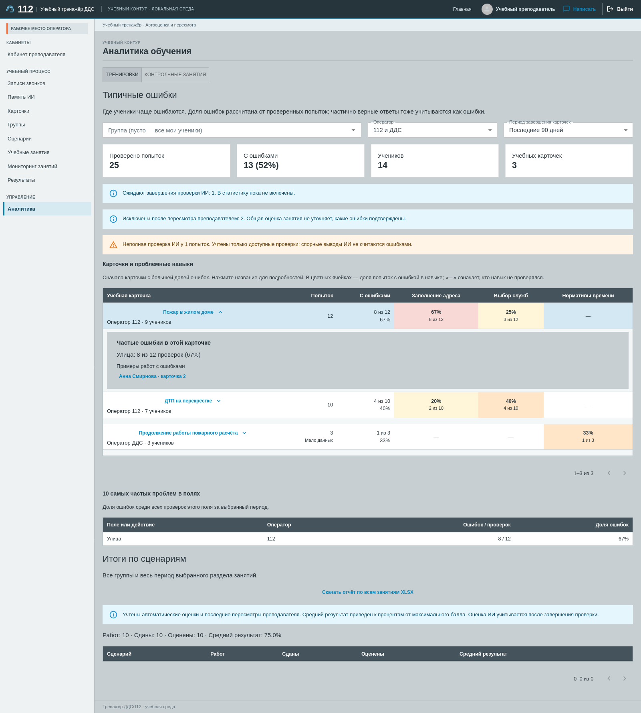

# Тренажёр 112/ДДС · Frontend

Учебные рабочие места операторов 112 и ДДС, кабинет ученика и инструменты преподавателя: карточки, сценарии, результаты и аналитика ошибок.

React · TypeScript · Vite · MUI · TanStack Query · Zustand.

## Запуск в Docker

Разместите репозитории `112-frontend` и `112-backend` рядом. Настройте `.env` по [инструкции бэкенда](../112-backend/README.md), затем из `112-backend`:

```sh
docker compose up --build -d --wait
```

Откройте **http://localhost:8080**. Nginx раздаёт интерфейс и направляет `/api/` в бэкенд. Тестовые пользователи и занятия создаются [seed-скриптом](../112-backend/docs/FULL_DEMO.md).

## Разработка

Нужны Docker и API на порту `8000`, запущенный [в режиме разработки](../112-backend/README.md#разработка). Команды ниже выполняются из `112-frontend`; Node работает в контейнере.

```sh
docker run --rm -it --name system112-frontend-dev -p 127.0.0.1:5174:5173 --add-host=host.docker.internal:host-gateway -v "$PWD:/app" -v system112-frontend-node-modules:/app/node_modules -w /app node:24-bookworm-slim sh -c 'npm ci && npm run dev -- --host 0.0.0.0'
```

Интерфейс с автоматическим обновлением: **http://localhost:5174**. Для другого адреса API добавьте к `docker run` параметр `-e API_PROXY_TARGET=http://адрес:порт`. По умолчанию запросы идут через `host.docker.internal:8000`.

Пока dev-контейнер запущен, в другом терминале:

```sh
docker exec system112-frontend-dev npm run lint
docker exec system112-frontend-dev npm test -- --maxWorkers=2
docker exec system112-frontend-dev npm run build
```

`lint` также проверяет границы FSD. Браузерные сценарии находятся в `e2e/`; проверки с реальным API требуют отдельной тестовой БД.

## Структура

```text
src/
  app/       Провайдеры, маршруты, тема
  pages/     Страницы
  widgets/   Составные блоки интерфейса
  features/  Действия пользователя и формы
  entities/  Предметные данные, типы и API
  shared/    Общие компоненты и инфраструктура
```

Соблюдаем FSD, SOLID, DRY и KISS. Типы — в `types`, стили — в `styles`, логика — в `model`. TanStack Query используется для серверных данных, Zustand — для общего локального состояния и черновиков. Подробнее: [архитектура](docs/FRONTEND_ARCHITECTURE.md), [состояние и API](docs/STATE_AND_API.md).

## Примеры интерфейса

<details>
<summary>Освоение интерфейса: подсветка нужной области и пошаговые объяснения</summary>


</details>

<details>
<summary>Аналитика преподавателя: частые ошибки и проблемные навыки</summary>



</details>
