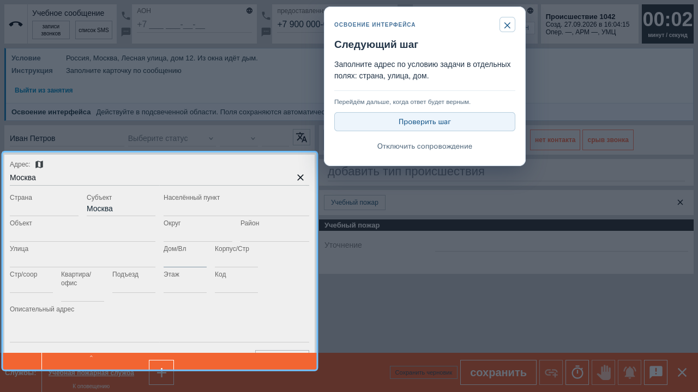
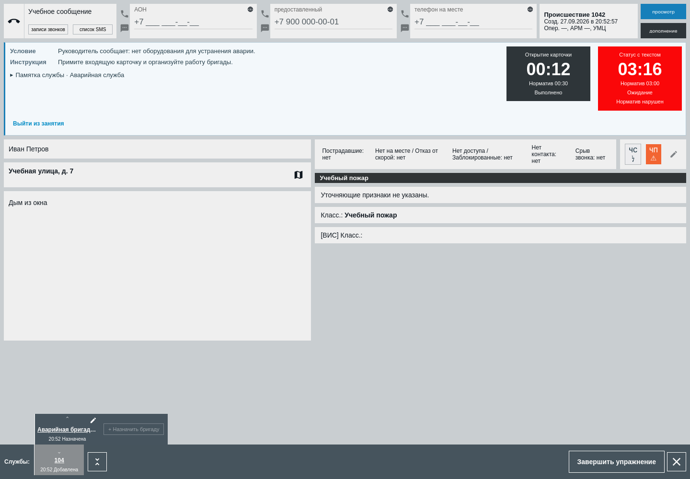

# Тренажёр 112/ДДС · Frontend

Учебные рабочие места операторов 112 и ДДС, кабинет ученика и инструменты преподавателя: карточки, сценарии, результаты и аналитика ошибок.

React · TypeScript · Vite · MUI · TanStack Query · Zustand.

## Запуск в Docker

Разместите репозитории `112-frontend` и `112-backend` рядом. Настройте `.env` по [инструкции бэкенда](../112-backend/README.md), затем из `112-backend`:

```sh
docker compose up --build -d --wait
```

Откройте **http://localhost:8080**. Nginx раздаёт интерфейс и направляет `/api/` в бэкенд. Тестовые пользователи и занятия создаются [seed-скриптом](../112-backend/docs/FULL_DEMO.md).

## Разработка

Нужны **Node.js 24 с npm** и API на `http://localhost:8000`. Docker для разработки фронтенда не требуется. Команды выполняются из `112-frontend`:

```sh
npm ci
API_PROXY_TARGET=http://localhost:8000 npm run dev
```

Откройте **http://localhost:5173**. Переменная `API_PROXY_TARGET` задаёт адрес бэкенда для прокси Vite.

```sh
npm run lint
npm test -- --maxWorkers=2
npm run build
```

`lint` проверяет также границы FSD. [Настройка окружения и браузерные тесты](docs/DEVELOPMENT.md).

## Структура

```text
src/
  app/       Провайдеры, маршруты, тема
  pages/     Страницы
  widgets/   Составные блоки интерфейса
  features/  Действия пользователя и формы
  entities/  Предметные данные, типы и API
  shared/    Общие компоненты и инфраструктура
```

Соблюдаем FSD, SOLID, DRY и KISS. Типы — в `types`, стили — в `styles`, логика — в `model`. TanStack Query используется для серверных данных, Zustand — для общего локального состояния и черновиков. Подробнее: [архитектура](docs/FRONTEND_ARCHITECTURE.md), [состояние и API](docs/STATE_AND_API.md).

## Примеры интерфейса

|                                                           Освоение интерфейса                                                            |                                                 Работа оператора ДДС                                                 |
| :--------------------------------------------------------------------------------------------------------------------------------------: | :------------------------------------------------------------------------------------------------------------------: |
| [](docs/screenshots/guide-address/firefox-address.png) | [](docs/screenshots/qa4/dds-1440.png) |
|                                          Подсветка нужной области и объяснение следующего шага.                                          |                               Состояние бригад и время реагирования в одной карточке.                                |

Нажмите на изображение, чтобы открыть его в полном размере. [Вся документация](docs/README.md).
